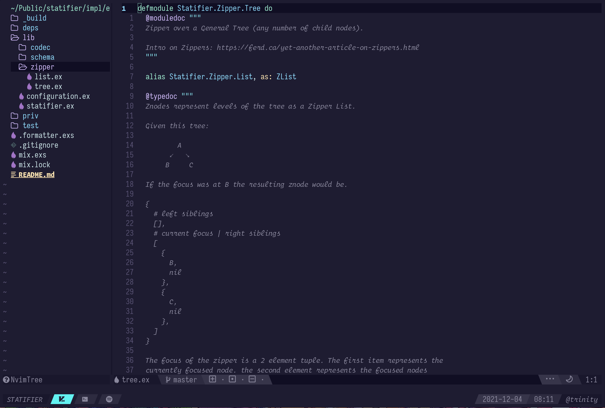

# Neovim Setup

## Highlights

* [Packer](https://github.com/wbthomason/packer.nvim) plugin manager
* Native LSP client (needs nightly)
* [Telescope](https://github.com/nvim-telescope/telescope.nvim) fuzzy finder
* [Nvim-tree](https://github.com/nvim-tree)
* [Galaxy](https://github.com/glepnir/galaxyline.nvim) statusline
