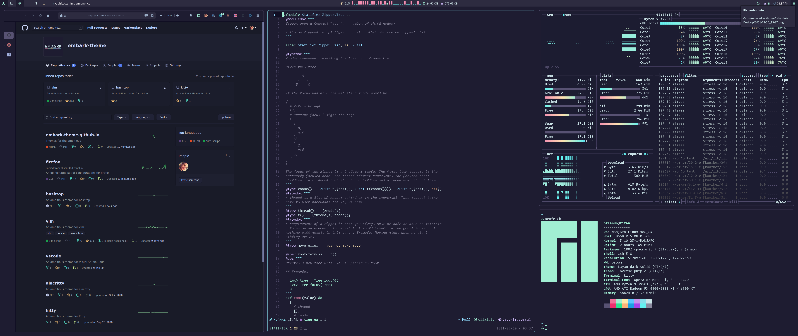

# Titan

My complete dev environment powered by [SaltStack](https://docs.saltstack.com/en/latest/contents.html). SaltStack is a very powerful configuration management tool similar to Ansible or Chef. This project came after several iterations of managing my dotfiles. Initially I was able to get by with just doing basic symlinking of folders. Over time though, I had more and more dependencies that became more complex to manage and install. The goal is to be able to provision a new machine with a few commands. Titan is my answer to this problem!

> Fair warning these dotfiles are optimized for me so make sure if you run any of these commands you are ready to accept the risk of losing your setup on your machine. You are probably better off just copying the actual config from any of my tools instead of running SaltStack commands listed here.



## Setup

Install dependencies

* git
* salt stack
* paru aur helper

## Running

Once all dependencies are installed you are ready to run titan. To install a singe module run the following from root of titan (replace nvim with any of the folder names in this repo based on which thing you want)
```
$ sudo salt-call --config=./ state.sls nvim
```

To get full state run this from root of titan
```
$ sudo salt-call --config=./ state.apply
```

